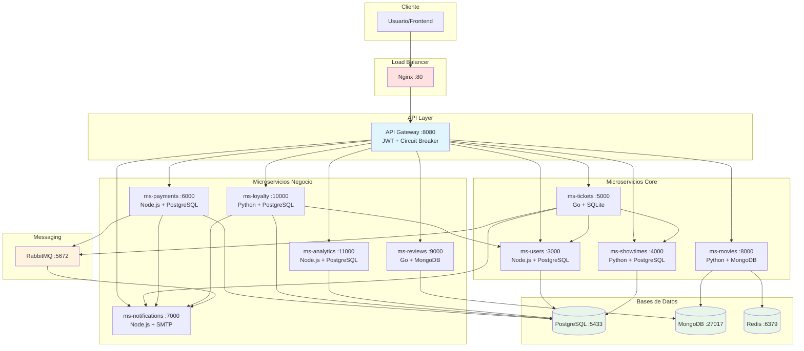
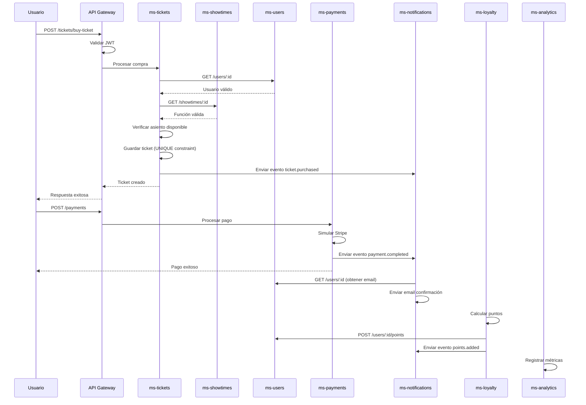
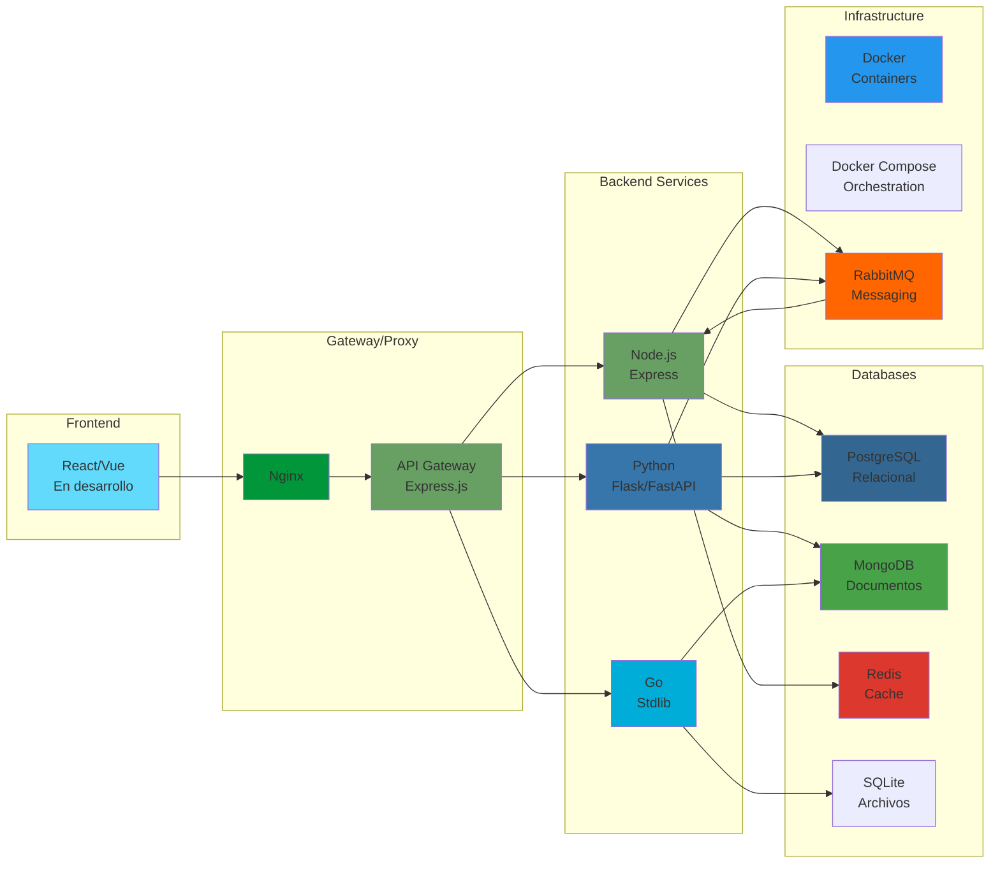

# Diagrama de Arquitectura del Sistema

## Flujo de Comunicación



## Flujo de Compra de Ticket



## Tecnologías por Capa



## Base de Datos: Esquema Relacional

```mermaid
erDiagram
    USERS ||--o{ TICKETS : compra
    USERS ||--o{ MEMBERSHIPS : tiene
    USERS ||--o{ PAYMENTS : realiza
    USERS ||--o{ REVIEWS : escribe
    
    SHOWTIMES ||--o{ TICKETS : contiene
    SHOWTIMES }o--|| THEATERS : en
    
    TICKETS ||--|| PAYMENTS : pagado_con
    
    MEMBERSHIPS ||--o{ POINTS_TRANSACTIONS : genera
    MEMBERSHIPS ||--o{ REDEMPTIONS : canjea
    
    REWARDS ||--o{ REDEMPTIONS : canjeado_en

    USERS {
        int id PK
        string name
        string email UK
        string password
        string subscription
        int points
        timestamp created_at
    }

    THEATERS {
        int id PK
        string name
        int total_seats
        array rows
        int seats_per_row
    }

    SHOWTIMES {
        int id PK
        int movie_id FK
        int theater_id FK
        timestamp start_time
        float price
    }

    TICKETS {
        int id PK
        int user_id FK
        int showtime_id FK
        string seat UK
        string status
        float price
    }

    PAYMENTS {
        int id PK
        int user_id FK
        int ticket_id FK
        float amount
        string status
        string stripe_id
    }

    MEMBERSHIPS {
        int id PK
        int user_id FK UK
        string tier
        int points
        int lifetime_points
    }

    REWARDS {
        int id PK
        string name
        int points_required
        string reward_type
    }
```

Este diagrama muestra la arquitectura completa del sistema, incluyendo:
1. Flujo de comunicación entre servicios
2. Flujo secuencial de compra de tickets
3. Stack tecnológico por capas
4. Esquema de base de datos relacional
